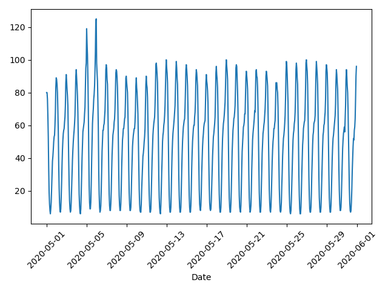
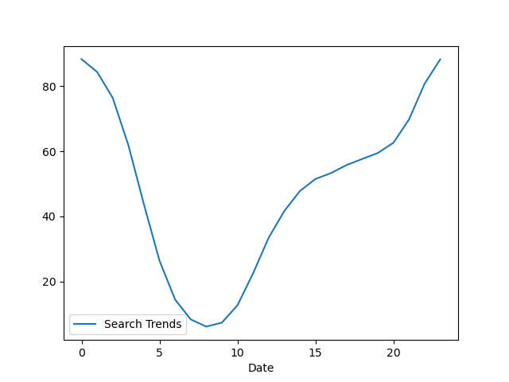
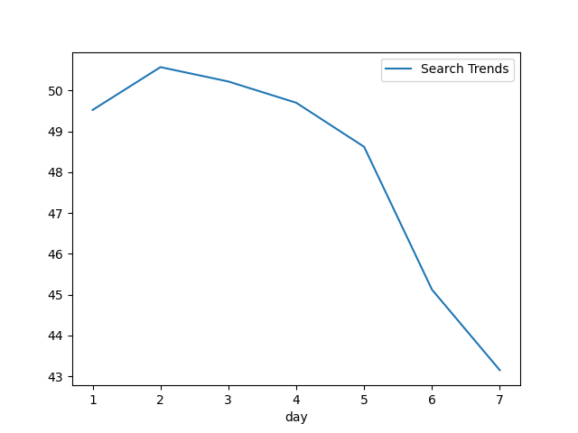
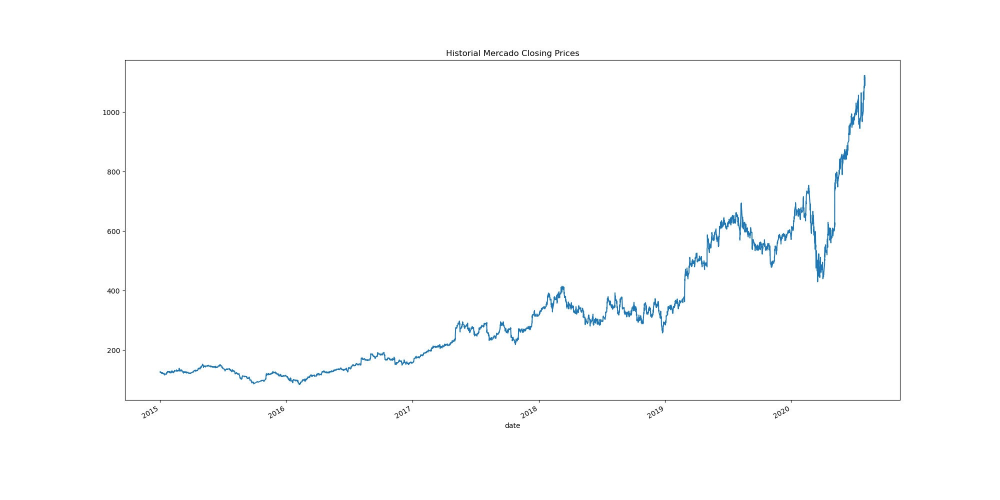
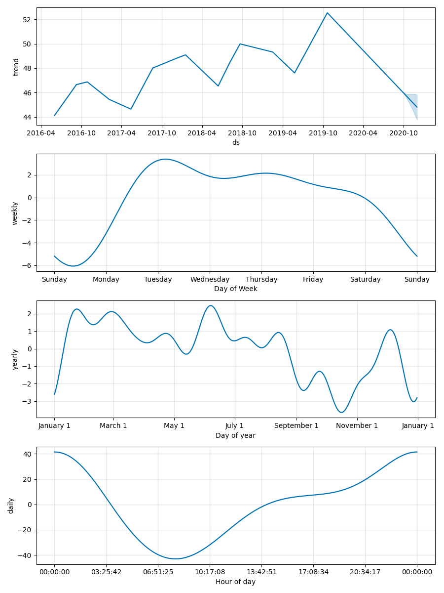

# prophet-challenge
Module 8 Challenge

# Functionality:
This application examines traffic for Mercado Libre, the most popular e-commerce sit in Latin America. The search data is further combined with stock data to examine patterns and is ultimately used to create a time series forecasting model to predict 80 days into the future.

### May 2020 Search Traffic Spike Coinciding with Release of Financial Results 
 

### Average Search Traffic By Hour

### Average Search Traffic by Day of Week

### Mercado Closing Stock Price

### Mercado Forecasting Model Components

# Approach:
The approach consisted of four steps.
1. The first step was to read search data into the dataframe and examine May 2020, which coincides with release of financial results. This step also included comparing May 2020 to the remainder of the data.
2. The second step was to mine the search traffic for seasonality by grouping the data day of the week, day of the month, and week of the year.
3. The third step was to examine search traffic patterns in relation to stock data patterns by concatenating stock data with search traffic.
4. The fourth step was to create a time series forecasting model using Meta's Prophet tool to predict the next 80 days of search traffic for Mercado Libre.

# Summary of Findings:
The data indicated the following findings:
1. May 2020 traffic, when financial results were released, did increase by 8.5% as compared to monthly averages.
2. During a 24 hour day, search traffic peaks between hours 23 and 0 and then drops to a low at hour 8.
3. During the week, traffic is highest during days 1 through 4 and then drops to a low for days 6 and 7. 
4. During the year, traffic is highest during the months of June, July, and August while week 10 in March shows the lowest traffic.
5. The correlations between stock return, stock volatility, and lagged search trends are extremely weak. In effect, using search trends in this capacity to predict stock return is ineffective.
6. Using the time series model, the most popular hour of the day is between 23:30 and 00:30 while Tuesday is the most popular day, and October is the least popular month.

# Plagerism Statement:
No specific code was copied but the sources below were referenced for examples and syntax. In addition, this challenge required a small amount of collaboration with the teaching assistant to understand assignment wording.

